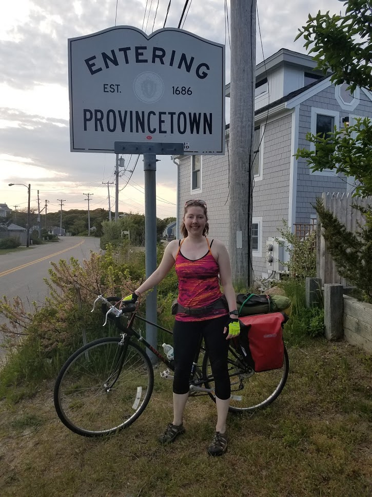

# Pretty Jimmy As A New Rider

If you're on the fence about doing your first long ride, here's some personal narratives from one-time new riders on how it was to take the plunge. I do not pay these people, and wherever possible, I do not edit their words.

## Avi, First Time Rider \`22
![Per Avi, "obligatory photo at the P-town \[town line\] sign".](../img/ptown_sign_avi.jpg)

If you haven't met me, you gotta know that I am unfit and uncoordinated as hell. And I still made it (with a ton of help from everyone). If you think you can't do the ride, I'm proof that it's possible, even if you don't have an athletic bone in your body (at the start). If you're thinking about it, here are a few things I wish I had known before last time. It's not too much because the tips on the website were really complete!

### Training
If you're in decent shape, [the schedule on the site](#training) works. I was not in good shape, and it still was (just barely) good enough! But the ride would have been much more comfortable had I pushed a little harder on a few things:
- Balance/core: I'm uncoordinated af and it took a lot of practice to be able to comfortably bike one handed while drinking water/eating snacks - but I totally lost that comfort because I was too tired halfway through day one. I highly recommend making practicing riding with one or no hands a regular part of your training routine from the beginning.
- Power/hills: I did not train enough at full load weight for some of the hills on the journey, and it really slowed me down when I had to take breaks on some of the longer climbs. I never really learned how to pedal consistently out of my seat but sometimes you just need that torque (it's on my list for 2023). I think my new goal of preparedness is to be able to hit a steep hill fully loaded *after* the longer training rides to make sure I've got enough endurance, but again, if you are in better overall condition it might not be necessary.
- Starting/stopping your bicycle quickly: I didn't anticipate this being an issue (you're ass in saddle for most of the ride) but it helps so much with being able to take quick stretch/snack breaks. You will also inevitably need to start while on a hill and being able to mount a bike off a bit of a running start (or that power stomp type start) without falling over (while fully loaded) would have been nice. \
\
The faster you can (comfortably) go, the more likely it is you make it before dark! The path was fine after sunset but setting up a tent in the dark is pretty challenging.
- Gear: mostly just follow the tips on the site, but I will emphasize: **optimize the fit and comfort of your bike before seriously training!** A comfy seat and ergonomic grips are an absolute must, but they also make training easier (wish I had known that earlier).

### The Ride
I was really surprised that the ride itself gets more enjoyable the longer you go. Getting out of Boston is really the worst of it - once you are in the suburbs proper it gets much much more fun. Getting started the second day was really rough, not gonna lie, but once I warmed up biking through the cape is beautiful, up until about halfway where it got downright magical (_ed. note: We all love the Cape Cod Rail Trail_).

Camping isn't as scary as I thought it was! Still not my cup of tea, but the campsites themselves have great facilities.
This is a really good group of people to ride with. I was in the slow group but there was a lot of fun conversation, chatter, and just jamming to whatever tunes people were blasting throughout. All of the stops (despite mostly being me starfishing on the nearest patch of soft-ish ground) were pretty fun too!
Everyone was really supportive of my struggling through it and slowing things down some, so many warm and fuzzy moments of people just cheering me through the hardest parts.

### When you get home
Ice everything! I didn't do this and probably exacerbated some (prior) long term injury things more than I should have. Is this a thing serious athletes know?
Exercise your finest humblebrag skills, people will be impressed as fuck and you will deserve it, but you don't want to seem too smug about it.

Overall, I actually want to do the ride again (I usually hate outdoorsy or physical things), and I can't think of a better endorsement than that!

## Shannon, First Time Rider \`19

_“And the day came when the risk to remain tight in a bud was more painful than the risk it took to blossom.” - Anaïs Nin_

Excerpts from my diary:

_“Just cresting a hill, I dropped my hands to the lower grips and crouched down. Wind blasted my face, thin road tires blurred in my peripheral vision as my bike sped faster and faster. It felt almost like flying.”_

_“Affogato :P”1_

_“Dappled sunlight, rough tree branches, birdsong, quiet rail trail”_

_“Perfectly New England towns, curvy roads, misty morning, turkey sightings, egg and lobster on a croissant, rosemary and grapefruit mimosa, comfort in friendship despite the damp cold air.”_

_“I looked down at the ocean waves. The ferry cut smoothly across them, even the tall ones. Boston skyline appeared in the distance, sun reflected off the water, and the wind battered me but I couldn't stop smiling.”_

<small>[1] If you don’t know what these are, you should: Italian for “drowned,” it’s espresso poured over vanilla gelato or ice cream</small>

______

I know that this ride can seem really daunting! I wanted to do it originally in 2018, put it off for a year, and still didn’t train as much as I wanted to in 2019. Yet, I had a great time and am going for it again this year. I hope to relate some of my experiences as a new rider, to demystify the whole process of preparing for the ride and to offer a first-person perspective of the ride itself. I know I had a lot of questions going into it and I hope to answer some of the questions I had and make it easier to join as a first-time rider.

### Bicycle
If you’re buying a bike, as I did, you don’t have to spend crazy amounts of money. You probably want a reliable, recently tuned up road bike with a rack and decent brakes. I bought mine on Craigslist a couple months after backing out of the 2018 ride. I consulted with George about models/years to look for. My budget was under ~$400. The bike I bought was more like $250 and it’s been great. I replaced the rack with one that was more sturdy, but otherwise my bike was in good condition when I bought it.

Whatever bike you use, do not skip training on it! Believe me when I say you want to follow the advice to train with the exact setup you will use on the ride (if not the whole time, at least for the last training ride or two). If not, chances are high you will be miserable/uncomfortable within the first hour and have to make hasty adjustments mid-ride, which is not fun.

### Training
As I mentioned, I didn’t train as much as I wanted to. I was in decent shape already; I was regularly running short distances (2-3 miles) and had a hot power yoga practice. I went on a variety of evening and weekend training rides in the 2 months leading up to Pretty Jimmy, mostly riding on the Charles River trail and trying to go farther each time. Distances ranged from 5-10 miles, up to maybe 25 miles roundtrip for my longest ride. I had hoped to do at least one longer ride, but couldn’t make it happen. Even though my longest training ride was short compared to the 140+ miles of Pretty Jimmy, I didn’t experience any injuries or severe discomfort on the ride. My legs were definitely sore though!

### Gear
This section repeats some things from the Packing List. I’ve added my thoughts on what gear was most useful for me. I packed a few different categories of gear: lightweight camping gear (which I already had), panniers/other cargo carriers, clothing & “comfort” items, and miscellaneous supplies & food.

#### Camping Gear
I absolutely recommend camping the first night with the rest of the crew. It’s a great time to connect with everyone, especially after being broken up into different sub-groups throughout the day. At a minimum, you’ll need shelter (tent or hammock) and something to sleep on/in (sleeping bag & pad, or blankets, whatever you need to be comfortable). My setup was a small backpacking-style tent and a sleeping bag that could pack down to about the size of a soccer ball. You can get away with something larger as long as it fits on your bike. I didn’t bother bringing a sleeping pad because I was terrified of over-packing! So instead, I depended on finding a comfy patch of pine straw to set my tent up on top of. That was mayyybe too extreme--I’m planning to pack a sleeping pad this year.

#### Panniers, etc
My biggest gear expense was panniers. You don’t /need/ to buy Ortlieb ones, but almost everyone else has them and it makes for a cute scene on the ride. In 2019, we had a full range of options from “strapping a regular backpack to the bike” to various cloth panniers, to Ortliebs which are fully waterproof and durable. I wanted to invest in gear that would last for many future rides, so I sprung for Ortlieb panniers. I really value waterproofness, and I have already used them on many shorter rides, so I don’t regret the purchase. In addition to panniers, you may want to look into other storage accessories. I didn’t bother, personally, since I was not a navigator and didn’t want to spend /too/ much money on my first bike touring ride. That said, you can go crazy with accessories, from baskets, to cell phone holders, to smaller panniers for the front of the bike, to mirrors, etc etc. I did buy a water bottle holder which is kinda indispensable, unless you are using a CamelBak.

#### Clothing & Comfort
The best advice I got was to pamper all points of contact between you and the bike. When you are in contact for 8 hours a day, every detail matters. Although you could probably survive the ride without these things, I made sure to have:
- Cycling gloves to protect my hands
- Padded shorts to protect my ass, which is the most critical IMO!
- Shoes with a stiff sole to efficiently transfer energy from legs to pedals—NOT squishy running shoes.
Even more efficient would be to have the type of pedals you shove your toes into, or attach to, but I personally feel uncomfortable with that. I ended up wearing a pair of Keens that were well-broken-in and they worked fine. If you aren’t familiar with outdoor sports in general, you should wear clothing that is 100% synthetic, not cotton, and have multiple layers. Keep at least one cozy and dry outfit well-protected from the elements to change into at the end of the day, especially if rain is in the forecast.

#### Miscellaneous Supplies / Food
I don’t have much advice in this area, except you know what you need best! Probably sunglasses, a hat, sunscreen, bugspray, a flashlight, a way to charge your phone, snacks, extra water bottles, and the like. I used a lot of sunscreen because I’m pale and the ride makes you sweat!!

### The Ride Itself
My stomach was in knots the first morning. Confronted with the reality of getting on my bike saddle and not getting off all day, I did not feel prepared at all. I had not taken the advice/demand seriously to do a training ride with my gear set up the same way it would be on Pretty Jimmy and I regretted it. That morning, I borrowed a couple of bungee cords to attach my tent to the top of my bike rack. Friends helped me adjust the clip-like parts of my panniers so that they actually stuck to my bike over rough terrain. I had under-packed clothes out of fear of too much weight and ended up borrowing a sweater that night. I had enough space for everything in my panniers, but wished I had thought through their organization, better.

We set off early that morning to get to the starting location on time. On the way from Somerville towards Longwood, over a particularly large bump, my metal water bottle popped out of the water bottle holder (I should have tested it beforehand!) and the top rolled into the river... not off to a good start. Luckily I didn’t have the same issue with a smaller plastic water bottle, which I used the rest of the ride.

As we waited for everyone to gather in the park under a few large trees, I ate a clif bar, applied sunscreen, and tried to stay calm. And then we rolled out. An early hiccup with navigation highlighted for me the importance of staying together, or being ready to navigate all the way to the next planned stop. I had downloaded the route on my phone but didn’t feel confident in the battery life (not to mention I didn’t have an easy way to keep my phone in front of me). We all had paper cue sheets for turns, but I didn’t have an odometer on my bike so distances would have been guesswork.

I felt a bit intimidated by how fast many of the others rode. Luckily, we had a “slow” group that went at a reasonable pace and the five of us stuck together for the whole ride. Riding up a long hill with traffic passing by, I struggled with finding the right gear and pushing myself to the top. Was this what the whole ride would be like? If so, I wasn’t sure if it would feel like an accomplishment or just a relief to finish.

I welcomed every stop. Luckily, there are many stops, almost more than I needed to stay fueled along the way. Eventually, the busy suburbs of Boston gave way to a calmer atmosphere at the top of the cape.

A few surprises given it was my first bike touring ride… riding with a full load didn’t feel much different than unloaded. My bike wobbled and fishtailed a little more when I was off the saddle, but I didn’t notice the weight as much as I thought I would. That said, the bike was definitely unwieldy when it came time to park! I quickly learned the art of leaning it against fences or tables since the kickstand was now useless. It felt good to stretch during breaks. If you’re used to riding alone or with just one other friend, it’s different to ride with a larger group. You don’t stop unless you call the whole group to stop. So any issues have to be dealt with /while/ you’re riding, or put off until planned breaks. Unless it’s an emergency, of course.

The second day was much more pleasant. Thanks to those padded shorts, getting back on the saddle wasn’t the misery I feared. Before we left the campground, a couple of us made some ergonomic adjustments to things like handlebar height and saddle positioning, which helped (and also could have been done before the ride even started…). 

As we ventured further along, the scenery got better and better, and a long stretch on the rail trail was positively serene. I really enjoyed the experience of Cape Cod from a bicycle. An adorable cafe called Hot Chocolate Sparrow was my favorite stop, and the maker of that affogato. Towards the end, we pedaled along curvy, hilly roads but the hills didn’t last long and the views made up for them. Whenever I rode near someone with a speaker and music, my mood lifted. A gorgeous sunset of deep pinks greeted us along the final stretch into Provincetown. We stopped at the sign to take celebratory selfies. I couldn’t believe we had actually made it!

All I can say is, yes, it is scary. Yes, it is worth it. There is nothing better than a fried clam after you’ve biked 100 miles. And the euphoria of coasting into Provincetown is incomparable. It just takes cojones, persistence, and a positive attitude. You will surprise yourself. And you will feel proud and elated that you did it, and all of a sudden find yourself asking: “So, when’s the next one?”
